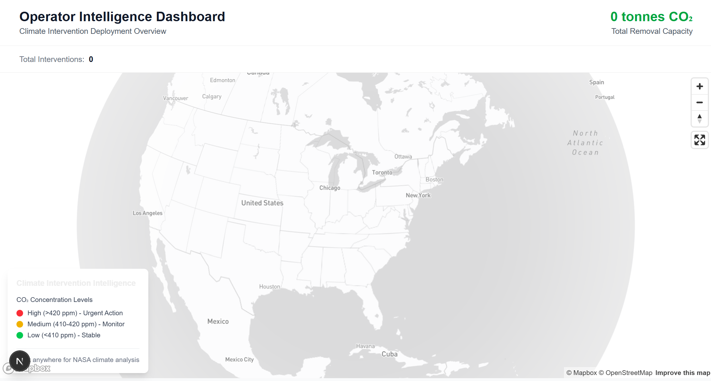
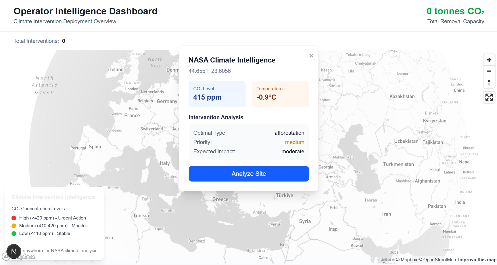

# Climate Intervention Coordination System MVP

Built to orchestrate large-scale climate interventions—DAC, biochar, afforestation—using satellite data, geospatial optimization, and NVIDIA Earth-2 simulations. Developed across multiple technical iterations with real user input, operator pilots, and production-ready architecture.

## Project Overview

**CICS** is a full-stack geospatial intelligence platform enabling climate operators to decide _where, when, and how much_ to deploy carbon removal technologies for **maximum cooling effect**.

**Why It Matters**: Today's interventions operate in silos — wasting millions in misallocated capital. CICS solves this by turning climate deployment decisions into **data-driven, real-time, optimized actions**.

## Product Highlights

- **Interactive Global Map** - Real-time visualization of climate metrics and intervention impact
- **Cooling Forecast Simulation** - NVIDIA Earth-2 integration for regional temperature projections
- **Multi-Operator Coordination** - Schedules interventions across actors to prevent overlap and boost synergy
- **Satellite Data Ingestion** - NASA feeds auto-ingested and geospatially indexed
- **Impact Analytics Dashboard** - Deployment ROI, risk, and regulatory overlays
- **Smart Site Selector** - Predicts top sites based on cost, climate impact, and constraints

## Architecture & Stack

### Frontend
- **Framework**: Next.js 15 + React 19 + TypeScript
- **Mapping**: Mapbox GL JS + Deck.gl (custom layers for interventions, biomass, CO₂)
- **UI/UX**: Tailwind CSS, Framer Motion, Auth pages via Supabase Auth

### Backend
- **APIs**: FastAPI (Python) + REST/GraphQL hybrid for high-flexibility querying
- **Climate Engine**: NVIDIA Earth2Studio (DLWP) for impact simulation
- **Queue System**: Celery for async intervention planning and data ingestion

### Data & Infra
- **DB**: Supabase PostgreSQL + PostGIS
- **Satellite APIs**: NASA OSDR
- **Time-Series & Spatial Indexing**: Climate grid tables, intervention logs, ROI zones
- **Security**: Role-based auth, row-level access, encrypted service tokens
- **CI/CD**: GitHub Actions for test, lint, deploy; Docker/K8s-ready for scale


## Technical Implementation

- **Modular Climate Engine**:
  - Python models simulate outcomes for DAC, biochar, and afforestation
  - Outputs: projected °C cooling, CO₂ ppm reduction, intervention score

**ML-Augmented Climate Engine**:
- **Lasso/Ridge Regression**: Predict intervention outcomes (CO₂ ppm, °C change) from historical and satellite features
- **Random Forest Classifier**: Assess site suitability across High / Medium / Low effectiveness tiers
- **Boosting Models**: Rank interventions by predicted impact, cost-efficiency, and regional policy alignment
- Enhances Earth2Studio forecasts with empirical performance modeling

**NVIDIA Earth-2 Integration**:
- Earth2Studio simulates 6–24 month cooling impact
- Supports multiple levers (DAC, biochar, afforestation)
- Advanced simulation mode with physics-based models
- Regional climate forecasting capabilities

**Dynamic Site Optimization**:
- PostGIS queries match interventions to geography, time, and cost-efficiency
- Integrates user-selected constraints: terrain, policy, seasonal viability
- Spatial indexing for high-performance geospatial queries
- Multi-objective optimization algorithms

## Core API Endpoints
CICS exposes a fully RESTful OpenAPI 3.1-compliant backend with endpoints for managing interventions, satellite data, impact simulations, and optimization. See [API_REFERENCE.md](backend/app/api/api_v1/endpoints/API_REFERENCE.md) for full endpoint docs.

## Getting Started

### Prerequisites
- Node.js 18+
- Python 3.11+
- PostgreSQL with PostGIS
- Redis (for Celery)
- Mapbox + Earth2Studio API keys

### Quickstart
```bash
git clone https://github.com/ruthvikjonna/climate-intervention-coordination-system.git
cd cics && npm install && pip install -r requirements.txt
npm run dev
```

### Final Thoughts
CICS isn't just another climate SaaS—it's the ops layer for Earth's thermostat. We simulate impact before you act, coordinate cross-actor deployments, and make planetary cooling precise, scalable, and actionable.

**"It's SimCity for the atmosphere—but real, and deployable."**
